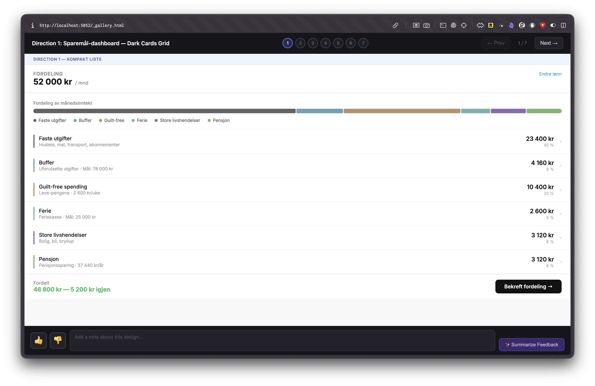
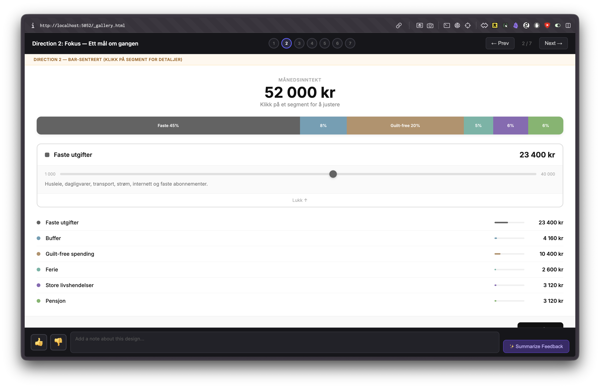
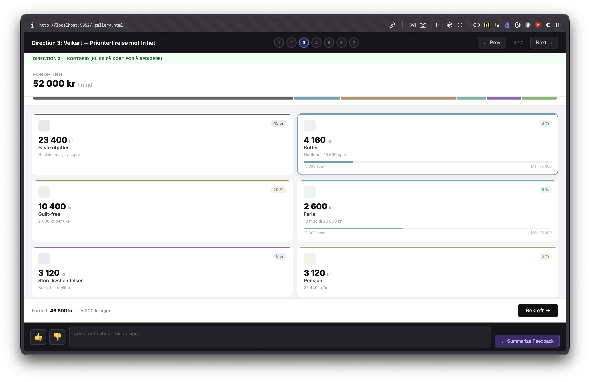
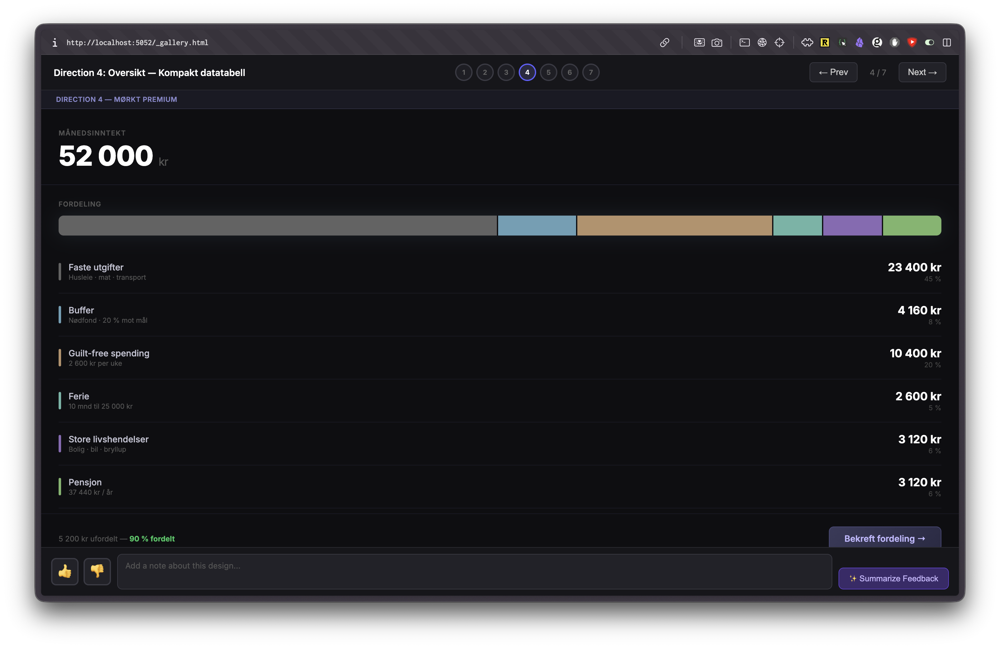
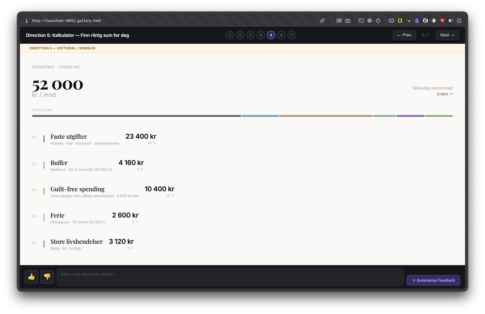
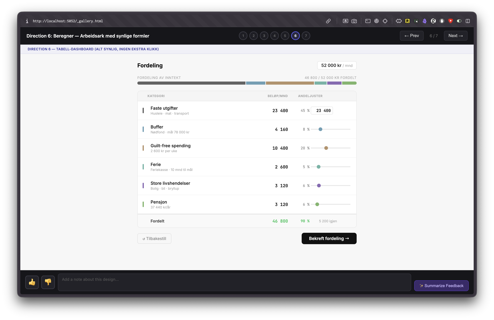
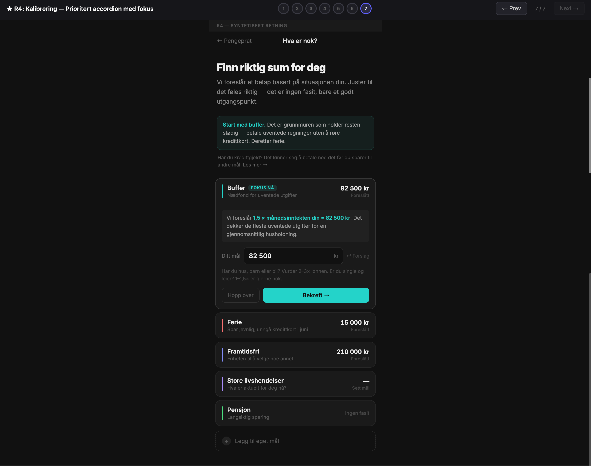

# design-explorer

Generate multiple distinct UI design directions and compare them side-by-side in an interactive gallery — instead of reacting to one mockup at a time.

> "You stop nitpicking one mockup and start comparing directions. 'I want the warmth of this one but the layout of that one' is a much more useful thing to say than 'move the button left.'"
>
> — [Stian Håklev](https://www.linkedin.com/posts/stianhaklev_so-ive-been-building-various-side-projects-activity-7439679667344834560-pzIX), who originated this approach

This skill is a reusable Claude Code implementation of the workflow Stian described: binary search for good designs using pure HTML rapid iteration with real app data, then converting the winning mockup to production code.

## How it works

1. **Context gathering** — Claude reads your codebase (colors, fonts, data shapes) and asks what screen you're designing
2. **Mockup generation** — produces 6–8 fully self-contained HTML mockups, each representing a different design philosophy (editorial, dark/premium, card-based, data-dense, etc.)
3. **Gallery viewer** — opens an interactive browser gallery where you can browse designs, vote 👍/👎, and add notes
4. **Feedback synthesis** — click "Summarize Feedback", paste the result back into Claude, and iterate

## Gallery UI









**Keyboard shortcuts in the gallery:**
- `←` / `→` — navigate between designs
- `U` — vote up
- `D` — vote down
- `Esc` — close summary modal

## Installation

```sh
cp -r skills/design-explorer ~/.claude/skills/
```

Or from the repo root:

```sh
ln -s "$PWD/skills/design-explorer" ~/.claude/skills/design-explorer
```

## Usage

Just describe what you want to design:

```
/design-explorer
```

Claude will ask a few questions, read your codebase, and generate the mockups. Works best when pointed at a real project — it uses actual colors, fonts, and data field names instead of Lorem ipsum.

## Requirements

- **Claude Preview MCP** — needed for the gallery viewer (`preview_start`). Without it, mockups are still generated and saved to `_design-exploration/` in your project root; you can open them manually in a browser.

## Credits

Originated by [Stian Håklev](https://www.linkedin.com/in/stianhaklev/) — see his [LinkedIn post](https://www.linkedin.com/posts/stianhaklev_so-ive-been-building-various-side-projects-activity-7439679667344834560-pzIX) for the original description and a video showing the workflow in action. This skill packages the same idea as a reusable, shareable Claude Code skill.

## Files generated

Claude writes all output to `_design-exploration/` in your project root:

```
_design-exploration/
├── _gallery.html     ← entry point for the gallery viewer
├── design-1.html
├── design-2.html
└── ...
```
